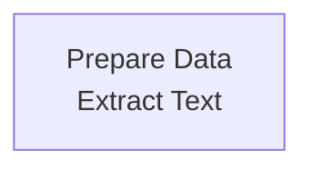

# banner_of_light_research_assistant

If your name isn't Dan or Theo, this is probably not for you.

This application prepares data from the 19th century newspaper Banner of Light to be analyzed by a AI research assistant powered by OpenAI

[](https://pypi.org/project/banner-of-light-research-assistant)
[](https://pypi.org/project/banner-of-light-research-assistant)

-----

**Table of Contents**

- [Installation](#installation)
- [License](#license)

## Installation

```console
pip install banner-of-light-research-assistant
```

## Usage

```console
banner-of-light-research-assistant --help
```

## License

`banner-of-light-research-assistant` is distributed under the terms of the [MIT](https://spdx.org/licenses/MIT.html) license.


