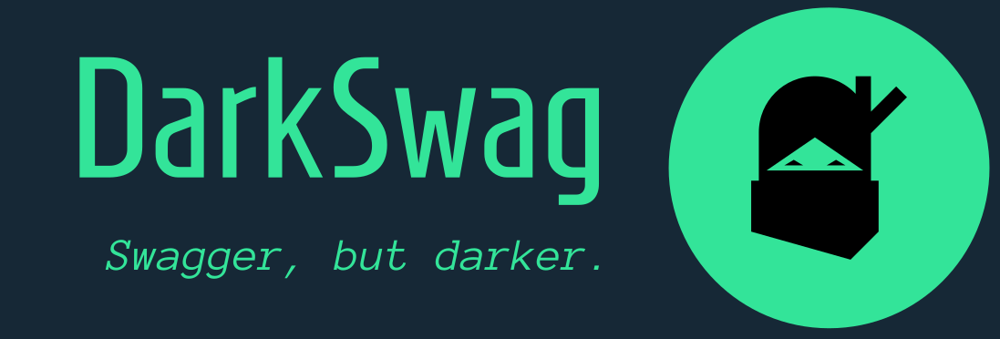

<hr>

Is this what you experience when you open Swagger?


`DarkSwag` module gives you dark-mode for <a href="https://swagger.io/specification/">Swagger OpenAPI</a> docs for your <a href="https://github.com/fastapi/fastapi?tab=readme-ov-file">FastAPI</a> apps.
  - Implementation can be as easy as a single line of code; see below for details
  - Defaults to dark-mode, but has a toggle for switching to light-mode (and back)
  - Light mode still supports the extra features added by `DarkSwag`
  - Allows you to optionally add your own logo to the top of the doc and a watermark-like background text for branding
  - Due to `FastAPI` pulling the `js`/`CSS` assets from a CDN by default, `Swagger` won't load without an internet connection *(unless already cached previously by your browser)*, but `DarkSwag` will, due to serving the assets as local static files.

**Changes / tweaks to standard Swagger:**
  - Reverses the auth padlock icon state (the standard behavior is backwards IMHO)
  - Auth modal grows vertically instead of scrolling within the inner div when you have several auth methods
  - Standard Swagger doesn't obfuscate the token field in the auth modal, but `DarkSwag` does.

<hr>


<hr>

## Installation
```shell
python -m pip install dark_swag
```

<hr>

## Implementation
There are three main ways you can implement this into your API.

<hr>

### Method 1: FastAPI class override (easiest)

  The easiest is to import the `FastAPI` override, as it requires no additional change to your existing code.

  ```python
  from dark_swag import FastAPI
  ```

  [Full example of this implementation](src/dark_swag/example.py)

  *The above example has a little bit of everything in it for the sake of testing.*

<hr>

### Method 2: Docs route factory (easy)

  You can import the `get_dark_router` factory function to generate a route that you can immediately add to your existing `FastAPI` instance.  You will need to set `docs_url=None` upon instantiating `FastAPI` class.

  ```python
  from dark_swag import get_dark_router
    
  app = FastAPI(docs_url=None) # this argument is required if you use this implementation
  app.include_router(get_dark_router(app))
  ```

  [Full example of this implementation](src/dark_swag/example2.py)

<hr>

### Method 3: Manually define the docs routes (if you need it)

  You can manually define the docs route(s) yourself, and use the helper function to generate the dark-enabled html.  This is a lot more tedius and involved, so you probably won't do it this way unless you have some very specific use case, but if you need it, this is how you can do it.  You will need to set `docs_url=None` upon instantiating `FastAPI` class.

  *(The example in this code block doesn't support toggling back to light mode, but the full example in the file does)*

  ```python
  from dark_swag import get_dark_swagger_html

  app = FastAPI(docs_url=None) # this argument is required if you use this implementation
    
  @app.get('/docs', include_in_schema=False)
  async def dark_swagger():
      return get_dark_swagger_html(app)
   ```

  [Full example of this implementation](src/dark_swag/example3.py)

### Note!

Be sure to add `docs_url=None` to your `FastAPI` instantiation if you use methods `#2` or `#3`, else it won't work, since `FastAPI` will generate the `/docs` endpoint internally and your manual definition of it won't overwrite it.  

This is still 100% `Swagger`.  We just inject CSS into the document head to create the dark theme in-flight before it's sent to the caller.  Reasoning for this is at the very bottom of this doc.

<hr>

## Features

### Custom Logo


You can add your own logo to the top-right corner of the `Swagger` doc by passing a URL or path to an image to the argument `logo`.

You can adjust the size by using the optional `logo_height` argument.  The width adjusts automatically and proportionally.  It defaults to 60px height if you don't use this argument.

You'll probably need to make a route to host them from, or you can also pass in the image as base64 format like this: 
 
1. If you used the `FastAPI` override, you add the argument to it:

  ```python
  # mounted path, like a FastAPI static endpoint
  app = FastAPI(logo='static/logo.png')
   
  """ OR """
   
  # raw base64 string with the appropriate prefix (below example is for an SVG)
  app = FastAPI(logo="data:image/svg+xml;base64,xucz0i... (shortened for illustration) ...L3d3dy")
  ```

2. If you used the `dark_router`, you add the argument to the factory function:

  ```python
  dark_router = get_dark_router(app, logo='static/logo.png')
  ```

3. If you used the helper function to get the `Swagger` HTML and manually defined your `/docs` endpoint, you add the argument to that helper function:
 
  ```python
  return get_dark_swagger_html(app, logo='static/logo.png')
  ```

<hr>

### Background Text
Like the above logo, this is also purely for aesthetics or branding.  You basically can pass in a word or short phrase, and it gets drawn on the background in a watermark-like fashion, purely to help branding or for aesthetics. Longer text will probably get truncated due to how this effect was accomplished.

1. If you used the `FastAPI` override, you add `background_text` argument with it:

  ```python
  app = FastAPI(background_text='Example 3')
  ```

2. If you used the `dark_router`, you add the `background_text` argument to it:

  ```python
  dark_router = get_dark_router(app, background_text='Example 3')
  ```
   
3. If you used the helper function `get_dark_swagger_html`, you do the same thing:
 
  ```python
  return get_dark_swagger_html(app, background_text='Example 3')
  ```

<br>

#### The text looks like this:

   
   
<hr>

## [Aziz, light!](https://www.imdb.com/title/tt0119116/quotes/?item=qt0464106&ref_=ext_shr_lnk)

For our friends and colleagues that enjoy being flashbanged when they open documentation, this built-in feature is for toggling light mode.  There's a toggle button at the top right.  Implementation methods `#1` and `#2` support this without doing anything extra.  

If you set `DarkSwag` up using the completely manual method `#3`, you need to define both `/docs` and `/docs_light` routes, as this just links between the two.  See [example3.py](src/dark_swag/example3.py) for a working example of this.

If you click the `Light Mode` toggle at the top right, it will enable light mode, and it will look very similar to the standard `Swagger` docs, only it still supports the addition of your own logo and the watermark-like background text.  There's also a toggle for switching back to dark mode.  The toggle isn't toggling CSS.  It's just linking back and forth between `/docs` and `/docs_light`.

  
  

<hr>

## [You shall not pass!](https://www.imdb.com/title/tt0120737/quotes/?item=qt0445998&ref_=ext_shr_lnk)

For some reason, the default behavior for Swagger is to show an unlocked padlock when you are **NOT** authenticated, and after authenticating, it changes it to a padlock that is locked.  

Maybe I'm the weird one, but that feels like the exact opposite of what I feel is logical.  To me, a locked padlock means I am not permitted access.  Regardless of why they did it this way, I hated it so much that I ended up fixing this annoyance.  When you are NOT authenticated, the padlock will be locked and red.  After you've authenticated, the padlock will be unlocked and green.  

To me, this makes more sense, and I think most people would agree.

**Not authorized yet:**<br>


**After authorization:**<br>


<hr>

Speaking of auth, the standard auth modal scrolls within the inner div when you have more than two auth methods.  This drove me crazy.  I attempted to fix this by allowing the inner and outer divs to grow as needed.  From my limited testing, this appears to have fixed it.  I did this for light mode as well.


<hr>

## [They're watching you, Neo.](https://getyarn.io/yarn-clip/b041886e-e4b1-4dc3-a28e-0db3e48b85d1)

For some reason, the token field in the auth modal in standard Swagger shows the value in plain text, so naturally, `DarkSwag` fixes this.

**Standard Swagger:**<br>

> <br>

**With DarkSwag:**<br>

> <br>
> 

<hr>

## Docstrings / Markdown

While it isn't super important, I decided to put a little more effort into coloring the formatted docstrings and markdown for things like the `FastAPI` instance description and the route docstrings and schemas.  I didn't do this for light-mode (yet).


<hr>

## Notes
Technically, there is a "cleaner" way to do this.  `FastAPI` provides a function you can call that generates the swagger doc, and you can pass in the javascript and css files, so there's an opportunity to feed it your own.

The reason why I did NOT go this route, is simply due to practicality.  Once de-minified, the `Swagger` style sheet is `11,490` lines long when pretty-printed.  It's obviously built from a packager and coalesced into a single file, with media queries to cover all bases, so it's no surprise why it can be so massive, but I wasn't about to invest that much time on this, so I went the route that most do: inject override CSS into the head before you return the `HTMLResponse`.  It's pretty limiting only being able to touch CSS, but I was still able to figure some things out like toggling light/dark modes, and allowing for an optional custom logo.  

If anyone has a better plan, feel free to contribute.  It's hard to test all possible cases as OpenAPI supports a ton of stuff, so there's a good chance some things might not be fully adjusted for dark mode, but they're easy to add as they're found.

### Bananas, isn't it?


The style sheet for dark mode ended up being around 600 lines at the time of writing this.  It's just small enough that I've considered converting the values to variables in order to templatize it, allowing for custom templates to make it easy to create and use themes.  If I get bored enough I might come back and work on that for fun.
