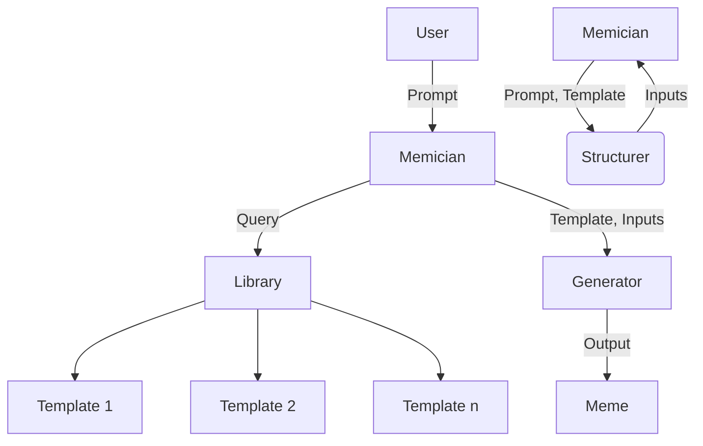

# Memician

*Memician is the state of the art Memelord*

```bash
$ pip install zf-memician
```

## Design

* Memician finds relevant memes by executing semantic search over the memes library
* Memician uses Rewriter to convert the user's prompt into a MemeLibrary search query
* Memician uses Structurer to convert the user's prompt into inputs for MemeTemplate



## Notes

* You can generate a concise description of a meme by using an LLM model


```
✨ Explain this given meme in 15 words or less: distracted boyfriend meme

Guy ignores his girlfriend, captivated by another woman representing a new interest or trend.
```

## Installation

### Sqlite3

Update your `/.zshrc` file:

```bash
export LDFLAGS="$LDFLAGS -L$(brew --prefix sqlite)/lib"
export CPPFLAGS="$CPPFLAGS -I$(brew --prefix sqlite)/include"
export PYTHON_CONFIGURE_OPTS="--enable-loadable-sqlite-extensions"
```

Then run:

```bash
pyenv install 3.11.9
pyenv global 3.11.9
python -m venv venv
source venv/bin/activate
pip install --upgrade pip
pip install -r requirements.txt
```

## Usage

```console
memician <path> <template> <*args> <*options>
```

- __path__ is where on your computer you want to save the meme.
- __template__ is the underlying template to use for the meme (not case sensitive).
- __\*args__ are all arguments to be placed onto the template.
  - Multi-word arguments must be surrounded by "" quotation marks
  - Arguments can be images, pasted onto the template. Image-links should be given in '<>' angle brackets.
- __\*options__ are the options that modify behavior of the generation.
  - Options are passed with '{}' curly braces.
  - Currently supported options: "stretch".

## License

All rights reserved.